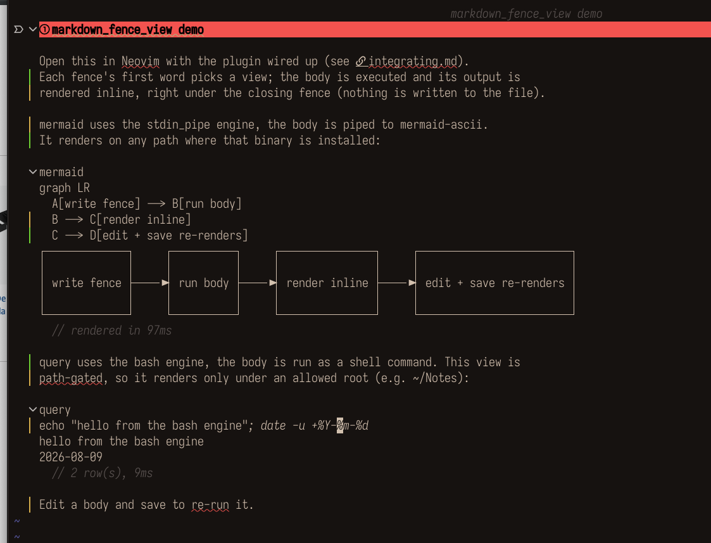

# markdown_fence_view

Spec-driven [`render-markdown.nvim`](https://github.com/MeanderingProgrammer/render-markdown.nvim) handler for fenced code blocks. Configure N views (each matches a fence language and describes how to execute the body) in a single `setup()` call.

Only depends on `render-markdown.nvim` at runtime, and only on the `markdown` treesitter parser at parse time.

## Install

With [lazy.nvim](https://github.com/folke/lazy.nvim):

```lua
{
  "mracos/markdown-fence-view.nvim",
  dependencies = {
    "MeanderingProgrammer/render-markdown.nvim",
    "nvim-treesitter/nvim-treesitter",
  },
}
```

It registers no side effects at load; you wire it into `render-markdown.nvim` yourself, see [docs/integrating.md](docs/integrating.md). To hack on it locally, point lazy at a checkout with `dir = "/path/to/markdown-fence-view.nvim"`.

## What it does

You write a fenced block whose info-string first word names a configured view. The plugin runs the body and renders its output inline, right under the closing fence, as virtual text (nothing is written to the file):

````markdown
```query
notes todos query --status open
```
````

renders as:



`docs/example.md` is a small file you can open to try it (and screenshot). Full mechanics: [docs/how-it-works.md](docs/how-it-works.md).

## Requirements

- Neovim 0.10+ (`vim.system`, `vim.uv.hrtime`, `vim.treesitter.query.parse`)
- [`render-markdown.nvim`](https://github.com/MeanderingProgrammer/render-markdown.nvim) — this module registers as a custom handler
- `nvim-treesitter` with the `markdown` parser installed

## Docs

- [Integrating](docs/integrating.md) — configure views, wire the handlers, public API, spec reference.
- [How it works](docs/how-it-works.md) — the render pipeline, reason lifecycle, cache invariants, write-back, internals.

## Tests

Busted specs live in `spec/*_spec.lua`. Run with `busted`.

## Provenance

Read-only mirror, generated and kept in sync by CI. PRs here are cherry-picked upstream and synced back, so open a PR rather than editing directly.
